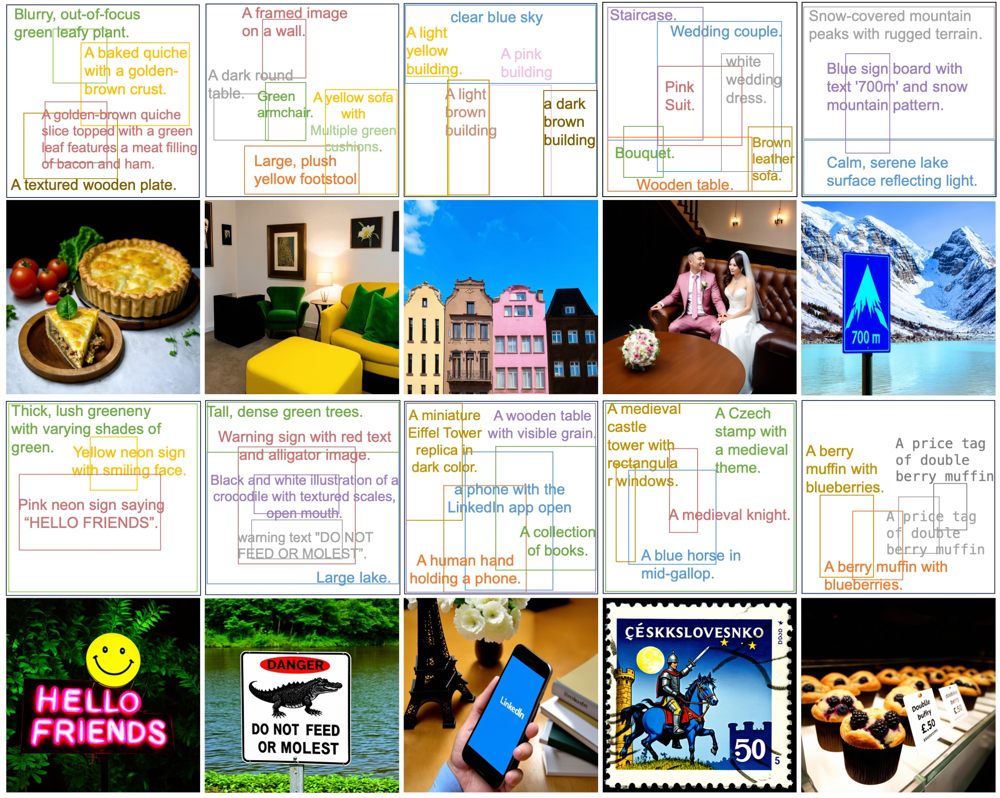
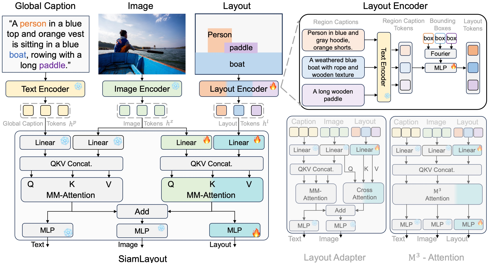
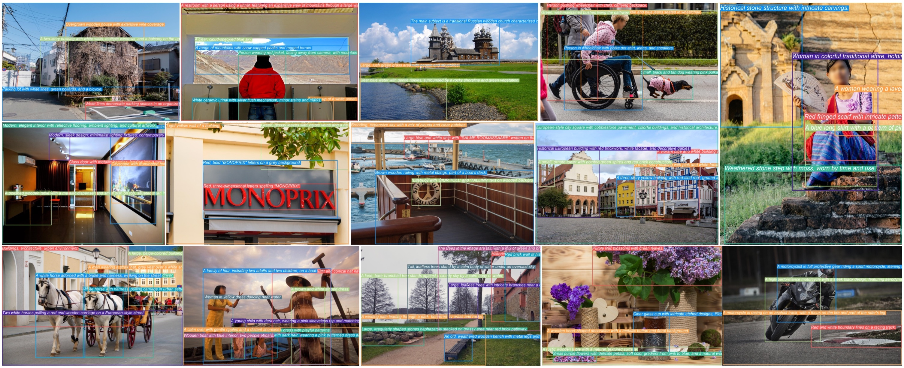

### <div align="center"> 🎨 CreatiLayout: Siamese Multimodal Diffusion Transformer for<br> Creative Layout-to-Image Generation</div>

#### <div align="center"> Hui Zhang, Dexiang Hong, Tingwei Gao, Yitong Wang, Jie Shao<br> Xinglong Wu, Zuxuan Wu, Yu-Gang Jiang<div> 

<div align="center">
  <a href="https://creatilayout.github.io/"></a> &ensp;
  <a href=""></a> &ensp;
  <a href=""></a> &ensp;
</div>

## ⏳ Schedule

- ✅ Release the Paper
- - [x] Release the Dataset
- - [x] Release the Model
- - [x] Release the Code

## 👀 Overview

### 🧐 Task Overview

<div align="center">
  
</div>

### 🧐 Model Overview

<div align="center">
  
</div>

### 🧐 Dataset Overview

<div align="center">
  
</div>


## ✒️ Citation

If you find our work useful for your research and applications, please kindly cite using this BibTeX:

```latex

```
